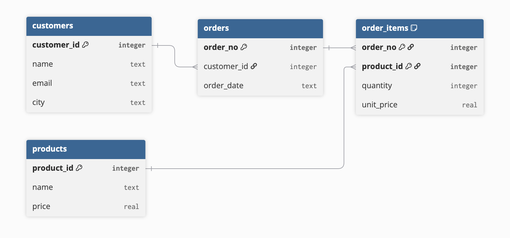

# Labs 3 svar

## 10.

- **Not a single value:** `phone_numbers` holds several values in one field.
- **Repeating group:** `course1/2/3` spread one kind of data across numbered columns; a fourth course would force a schema change.
- **No primary key:** nothing uniquely identifies a student.
- **Poor data integrity:** course names as free text can be spelled inconsistently.
- **Hard to query:** finding everyone on a course means searching three columns.
- **Unclear field name:** the column `student` actually holds the student's name, so `name` (or `student_name`) would be clearer.

## 11.

`products` breaks 1NF: it holds several products in one field. Fix it with a junction table `order_items` that links to `products`.

## 12.

`customer_email` is in the wrong place: it describes the customer, not the order, so it depends on `customer_id` rather than the order key (a 3NF violation) – move it to the `customers` table and keep only `customer_id` here.

## 13.
'<u>Students</u> take lessons from teachers. A <u>lesson</u> has a <u>date</u>, <u>time</u>, <u>room</u> and
<u>instrument</u>. One <u>teacher</u> can teach many instruments.' 

## 14.
